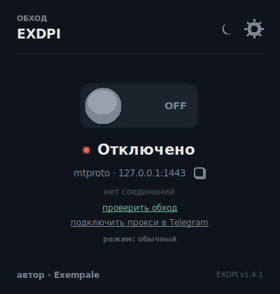
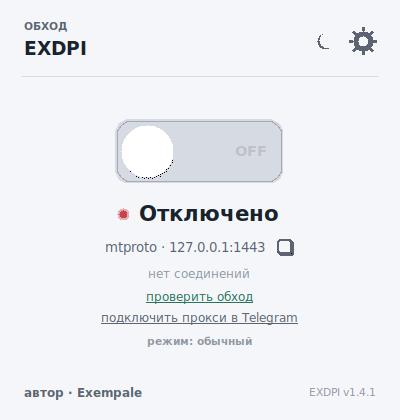
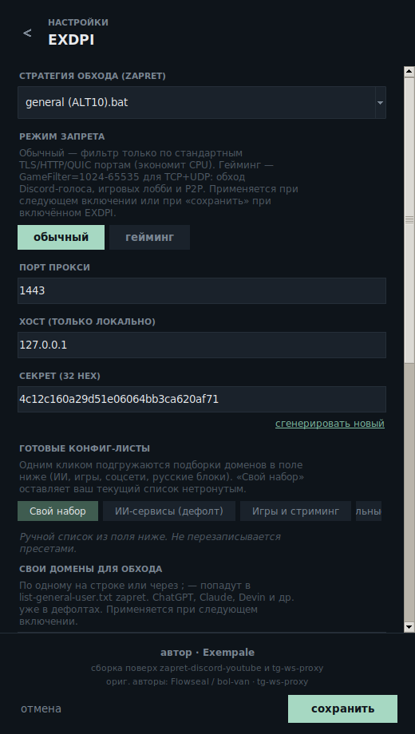
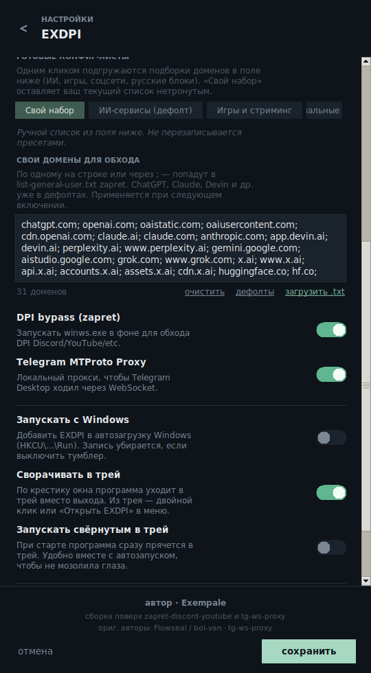
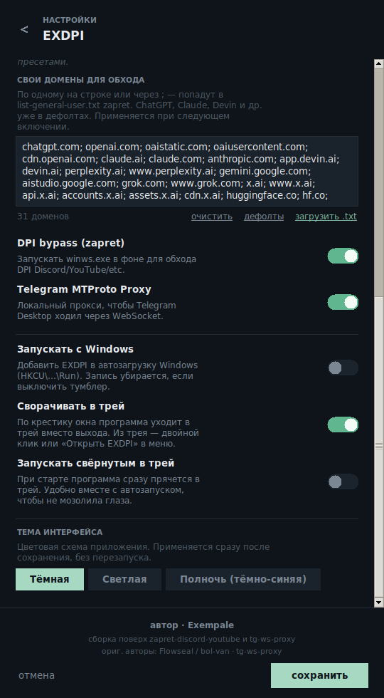
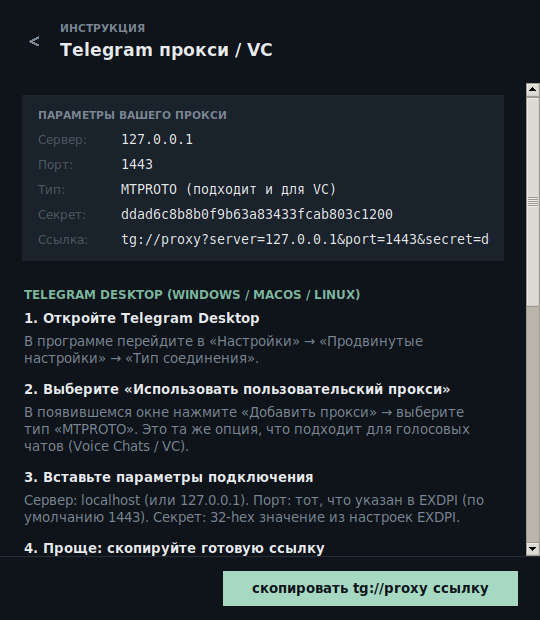

# EXDPI — zapret + tg-ws-proxy в одном окне


Автор сборки: **Exempale**. Логика обхода и прокси целиком взята из оригинальных
репозиториев основных авторов — этот проект только объединяет их в один GUI.

* **[zapret-discord-youtube]** — обход DPI через WinDivert (`winws.exe`) для Discord, YouTube и пр.
* **[tg-ws-proxy]** — локальный MTProto-прокси для Telegram, который ходит к DC через WebSocket.

---

## Скриншоты

<table>
  <tr>
    <td align="center"><b>Тёмная тема</b><br></td>
    <td align="center"><b>Светлая тема</b><br></td>
  </tr>
</table>

Главное окно: большой переключатель ON/OFF, индикатор состояния, готовая
`mtproto`-ссылка для одного клика и текущий режим работы. Иконка солнца/луны
в углу переключает тему (тёмная ↔ светлая), шестерёнка ведёт в настройки.

### Настройки — стратегия и режим запрета



Тут же сегментный переключатель **«обычный / гейминг»** для zapret — он реально
влияет на параметры `winws.exe` (`GameFilter*` = `1024-65535` в гейминг-режиме,
`12` в обычном — см. [исходник стратегий][zapret-discord-youtube]).

### Настройки — готовые конфиг-листы



Одним кликом подгружаются подборки доменов из `blocklists/` (Игры и стриминг,
Социальные сети, Популярное в РФ) либо встроенные ИИ-сервисы. Выбранный пресет
записывается в `list-general-user.txt` zapret при следующем включении.

### Настройки — тема интерфейса



Тему можно переключить и из настроек (Тёмная / Светлая). Применяется сразу
после сохранения — без перезапуска приложения.

### Инструкция по подключению к Telegram



Кнопка «подключить прокси в Telegram» в главном окне открывает встроенную
пошаговую инструкцию для Telegram Desktop и голосовых чатов (VC) — с готовыми
параметрами вашего прокси и кнопкой «скопировать `tg://proxy`».

---

## Запуск (готовый .exe)

1. Скачайте `EXDPI.exe`.
2. Запустите. Программа сама запросит права администратора (UAC) — это нужно
   для драйвера WinDivert, который ловит пакеты на сетевом уровне.
3. Щёлкните по большому переключателю — оба сервиса (zapret + локальный
   MTProto-прокси) поднимутся одновременно.
4. Кнопка-иконка «шестерёнка» справа сверху → настройки (стратегия zapret,
   режим запрета, тема, пресеты доменов, порт прокси, секрет).
5. Кнопка-иконка «солнце/луна» рядом с шестерёнкой переключает тему
   (тёмная ↔ светлая).
6. Кликом по 📋 рядом с `mtproto · 127.0.0.1:1443` копируется `tg://proxy?…`
   ссылка для импорта в Telegram Desktop.

### Системные требования

* Windows 10 (1809+) или Windows 11, x64.
* Права администратора (UAC) — для загрузки драйвера WinDivert.

---

## Подключение Telegram к встроенному прокси (включая Voice Chats)

EXDPI поднимает локальный MTProto-прокси на `127.0.0.1:1443` (порт настраивается).
Этот же прокси Telegram использует и для текста, и для голосовых чатов (VC) —
отдельной настройки внутри VC делать не нужно.

### Telegram Desktop (Windows / macOS / Linux)

1. Запустите EXDPI и включите большой переключатель ON.
2. В главном окне кликните по 📋 рядом с `mtproto · 127.0.0.1:1443` — в буфер
   обмена попадёт ссылка вида `tg://proxy?server=127.0.0.1&port=1443&secret=dd…`.
3. Откройте Telegram Desktop → **Настройки** → **Продвинутые настройки** →
   **Тип соединения**.
4. Выберите **«Использовать пользовательский прокси»** → **Добавить прокси** →
   тип **MTPROTO**.
5. Либо вставьте параметры вручную: сервер `127.0.0.1`, порт `1443`,
   секрет — 32-hex значение из настроек EXDPI (поле «секрет»). Либо просто
   вставьте `tg://proxy?…` ссылку — Telegram сам раскидает поля.
6. В правом верхнем углу Telegram появится зелёная иконка прокси — значит
   подключение установлено.

### Голосовые чаты (VC) и звонки

Telegram использует один и тот же прокси и для текста, и для голосовых чатов.
Никакой отдельной настройки внутри Voice Chat делать не нужно.

Если в VC вас не слышно или собеседник «прерывается» — обычно проблема в
стратегии zapret, а не в прокси:

* Попробуйте другие стратегии: `general (ALT10).bat` (по умолчанию) → `general
  (FAKE TLS AUTO).bat` → `general (SIMPLE FAKE).bat`.
* Включите **гейминг-режим** в настройках EXDPI — он расширяет
  `GameFilter` до диапазона `1024-65535` для TCP+UDP, через который ходит
  голосовой трафик Discord/Telegram и P2P-лобби.

---

## Обычный vs гейминг режим (zapret)

Переключатель **«режим запрета»** в настройках реально меняет параметры запуска
`winws.exe`. Под капотом он подставляет порты в `%GameFilter*%` в `.bat`-стратегии:

| Режим | TCP-порты | UDP-порты | Когда выбирать |
|-------|-----------|-----------|----------------|
| **Обычный** | стандартные TLS/HTTP (`80,443,…`) | `443,19294-19344,50000-50100` | Веб-сёрфинг, YouTube, обычный Telegram, экономия CPU. |
| **Гейминг** | `80,443,…` + `1024-65535` | `443,…` + `1024-65535` | Discord voice, Telegram VC, игровые лобби, P2P-трафик. |

Изменение применяется при следующем включении или при «сохранить» при
включённом EXDPI (он автоматически перезапустит zapret).

---

## Готовые конфиг-листы (пресеты доменов)

В разделе «Готовые конфиг-листы» можно одним кликом загрузить набор доменов
вместо ручного ввода. Все файлы лежат в `blocklists/` и редактируемы:

| Пресет | Описание | Файл |
|--------|----------|------|
| Свой набор | Ваш собственный список — изначально пустой, сохраняется отдельно от пресетов. | — |
| ИИ-сервисы | ChatGPT, Claude, Devin, Gemini, Grok, Perplexity, HuggingFace. | `app/config.py: DEFAULT_CUSTOM_DOMAINS` |
| Игры и стриминг | Discord (текст+голос), Steam, Epic, Battle.net, Riot, Roblox, Twitch, OBS. | `blocklists/exdpi-games.txt` |
| Социальные сети | X/Twitter, Instagram, Facebook, Reddit, TikTok и др. | `blocklists/exdpi-social.txt` |
| Популярное в РФ | ИИ, видео, мессенджеры, новости — частые блокировки. | `blocklists/exdpi-popular-ru.txt` |

При сохранении настроек выбранные домены пишутся в
`resources/zapret/lists/list-general-user.txt`, который уже подхватывается
любой стратегией `general*.bat` через `--hostlist=...`.

---

## Темы оформления

| Тема | Описание |
|------|----------|
| **Тёмная** | Стандартная (по умолчанию). |
| **Светлая** | Для дневного использования и скриншотов. |

Переключается:
* Иконкой «солнце/луна» в шапке главного окна (тёмная ↔ светлая).
* В настройках → «Тема интерфейса» — явный выбор.

Тема применяется сразу, без перезапуска. Текущий выбор сохраняется в
`%APPDATA%\EXDPI\config.json`.

---

## Авто-обновления

EXDPI на старте проверяет GitHub Releases и предлагает скачать новую версию.
Логика отображения окна зависит от номера новой версии:

| Тип релиза | Пример | Поведение |
|------------|--------|-----------|
| **Обязательный** | `1.5.0`, `2.0.0` (третья цифра = 0) | Окно нельзя закрыть. Любое закрытие/Esc завершает приложение — без обновления EXDPI не работает. |
| **Необязательный** | `1.5.1` … `1.5.9` (третья цифра ≠ 0) | Можно «пропустить обновление» — диалог уйдёт на 3 дня. |

То есть в схеме `MAJOR.MINOR.PATCH`:
* увеличение `MINOR` (и обнуление `PATCH`) — критический релиз, апдейт обязателен;
* увеличение `PATCH` — мелкие правки, можно отложить.

---

## Структура

```
EXDPI/
├── main.py                 # Точка входа + UAC-эскалация
├── manifest.xml            # requireAdministrator
├── version_info.txt        # Метаданные exe
├── build.spec              # PyInstaller spec
├── app/
│   ├── theme.py            # Темы (dark/light) + apply_theme()
│   ├── presets.py          # Пресеты доменов (custom/ai/games/social/...)
│   ├── widgets.py          # AnimatedToggle, IconButton, StatusDot
│   ├── ui_app.py           # Главное окно
│   ├── ui_settings.py      # Окно настроек
│   ├── ui_tg_guide.py      # Окно-инструкция по Telegram прокси
│   ├── controller.py       # Стейт + объединение zapret и proxy
│   ├── zapret_runner.py    # Парсер .bat и запуск winws.exe
│   ├── proxy_runner.py     # Запуск tg-ws-proxy в фоновом потоке
│   ├── config.py           # JSON-конфиг в %APPDATA%\EXDPI
│   ├── updater.py          # Авто-проверка обновлений через GitHub Releases
│   ├── autostart.py        # Автозапуск Windows (HKCU\…\Run)
│   ├── tray.py             # Системный трей (pystray)
│   ├── dpi_test.py         # TLS-handshake тестер
│   ├── ui_dpitest.py       # Окно «Проверить обход»
│   └── paths.py            # Резолв ресурсов (dev/PyInstaller onefile)
├── blocklists/             # Пресеты готовых доменов (.txt)
├── docs/screenshots/       # Скриншоты для README
├── proxy/                  # Исходники tg-ws-proxy (без изменений)
└── resources/
    ├── icon.ico
    ├── icon.png
    └── zapret/             # winws.exe + WinDivert + general*.bat + lists/
```

Конфиг хранится в `%APPDATA%\EXDPI\config.json`. Удалите файл — параметры
сбросятся к дефолтам.

---

## Сборка из исходников

Понадобится Windows + Python 3.11+.

```bat
py -3.11 -m venv .venv
.venv\Scripts\activate

pip install -U pip
pip install pyinstaller customtkinter Pillow pyperclip cryptography psutil pystray

pyinstaller build.spec --clean --noconfirm
```

Результат — `dist\EXDPI.exe` (single-file, ≈17 МБ).

> При желании добавьте `upx=True` в `build.spec` и UPX в `PATH`, чтобы ужать
> бинарник примерно вдвое.

---

# Лицензии и происхождение

* Сборка / GUI — **Exempale** (`nevafav`).
* zapret-discord-youtube — Flowseal / bol-van (см. оригинальный репозиторий).
  Бинарь `winws.exe`, драйвер WinDivert и `general*.bat` стратегии взяты
  из оригинального релиза без изменений.
* tg-ws-proxy — оригинальный код в `proxy/`, не модифицирован.

[zapret-discord-youtube]: https://github.com/Flowseal/zapret-discord-youtube
[tg-ws-proxy]: https://github.com/Flowseal/tg-ws-proxy