<div align="center">

# EXDPI

### Обход DPI и VPN в одном окне

Обход блокировок (Discord, YouTube, Telegram) и полноценный системный VPN на sing-box
в одном лёгком GUI под Windows. Оба режима переключаются одной кнопкой.

[](https://github.com/Exempale/EXDPI/releases)
[](https://github.com/Exempale/EXDPI/releases/latest)
[](LICENSE)
[](#системные-требования)

[](http://t.me/send?start=IV5iNcieHvH7)

[**Скачать последнюю версию**](https://github.com/Exempale/EXDPI/releases/latest) · [Скриншоты](#главное-окно) · [Установка](#запуск-готовый-exe) · [Настройки](#настройки) · [Telegram-прокси](#подключение-telegram-к-встроенному-прокси-режим-dpi-включая-voice-chats)

</div>

---

Автор сборки: **Exempale**. Логика обхода, прокси и VPN-ядро взяты из оригинальных
репозиториев основных авторов, этот проект просто объединяет их в одном GUI.

EXDPI работает в двух режимах, переключаются прямо в главном окне:

| Режим | Что внутри | Для чего |
|---|---|---|
| **DPI** | [zapret-discord-youtube] (`winws.exe`) + [tg-ws-proxy] | Точечный обход блокировок Discord, YouTube, Telegram. Без туннеля, минимум нагрузки на CPU |
| **VPN** (новое в 2.0.0) | Ядро **sing-box**: vless, shadowsocks, vmess, trojan, hysteria2, tuic | Полный системный туннель, подписки по URL, выбор локации |

---

## Главное окно

Большой переключатель ON/OFF, индикатор состояния, переключатель режима DPI/VPN,
иконки темы (солнце/луна) и настроек. Есть тёмная и светлая темы.

### Режим DPI

<table>
  <tr>
    <td align="center"><b>Тёмная</b><br>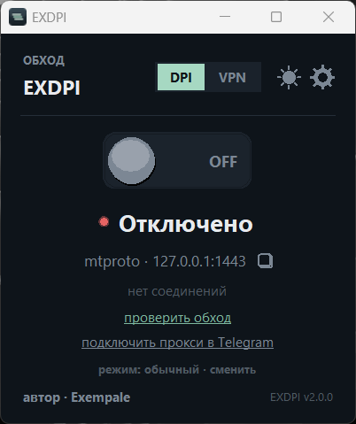</td>
    <td align="center"><b>Светлая</b><br>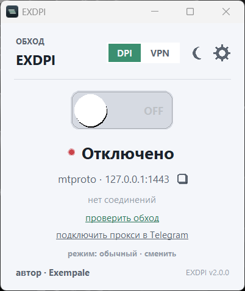</td>
  </tr>
</table>

В режиме DPI поднимаются zapret и локальный MTProto-прокси. Готовая `mtproto`-ссылка
копируется одним кликом, есть кнопки «проверить обход» и «подключить прокси в Telegram».

### Режим VPN

Пока подписка не задана, список пуст:

<table>
  <tr>
    <td align="center"><b>Тёмная</b><br>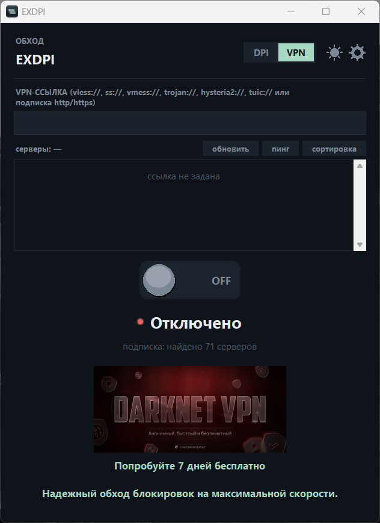</td>
    <td align="center"><b>Светлая</b><br>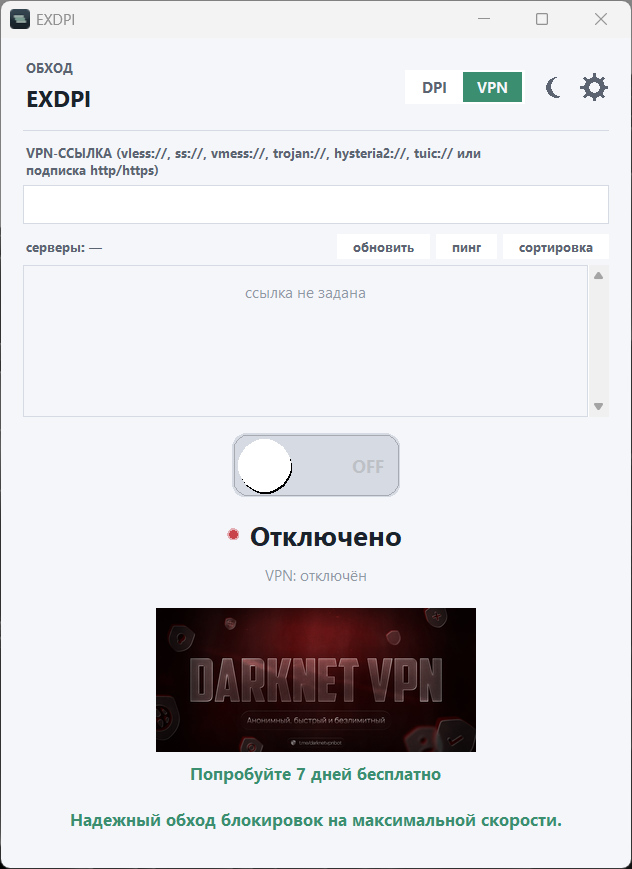</td>
  </tr>
</table>

После импорта подписки подтягивается список локаций с флагами стран и названиями:

<table>
  <tr>
    <td align="center"><b>Тёмная</b><br>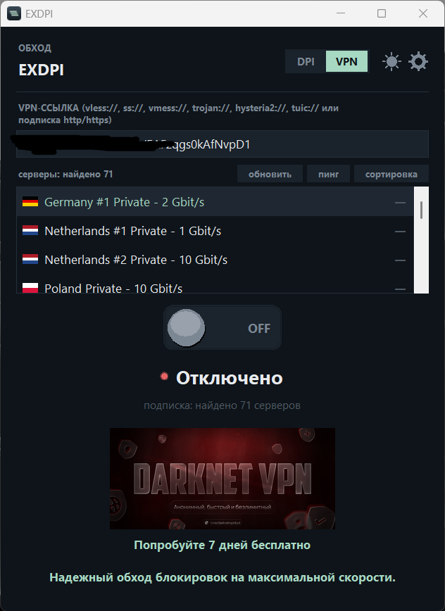</td>
    <td align="center"><b>Светлая</b><br>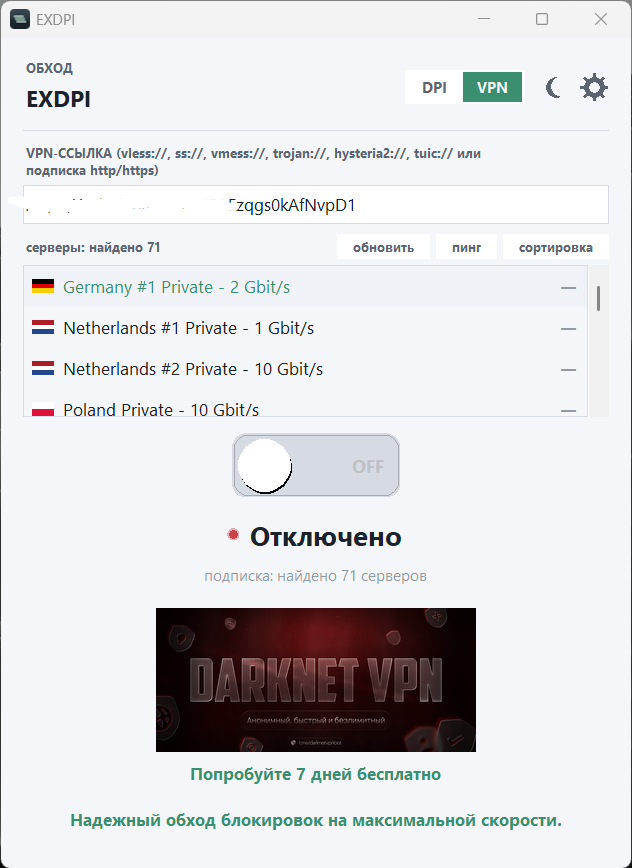</td>
  </tr>
</table>

---

## Запуск (готовый .exe)

1. Скачайте `EXDPI.exe` со [страницы релизов](https://github.com/Exempale/EXDPI/releases/latest).
2. Запустите. Программа сама запросит права администратора (UAC): это нужно для драйвера WinDivert в режиме DPI и для TUN-интерфейса в режиме VPN.
3. Выберите режим, DPI или VPN, переключателем в главном окне.
4. Щёлкните по большому переключателю, чтобы включить выбранный режим.
5. Кнопка «шестерёнка» справа сверху открывает настройки (три вкладки: DPI, VPN, Общее).
6. Кнопка «солнце/луна» рядом с шестерёнкой переключает тему.

### Системные требования

* Windows 10 (1809+) или Windows 11, x64.
* Права администратора (UAC) для WinDivert (DPI) и TUN-интерфейса (VPN).

---

## Режим VPN (sing-box)

В режиме VPN EXDPI поднимает глобальный системный туннель на движке sing-box.

### Что поддерживается

* Протоколы: vless, shadowsocks (ss), vmess, trojan, hysteria2, tuic.
* Прямые ссылки (`vless://…`, `ss://…` и т.д.) и подписки по URL.
* Импорт подписки одной ссылкой, приложение само тянет список серверов.
* Опционально, шифрование DNS (DoH/DoT) для запросов внутри туннеля.

### Список серверов

После импорта подписки локации показываются списком, с флагами стран и
человекочитаемыми названиями. Над списком три кнопки:

| Кнопка | Действие |
|---|---|
| **обновить** | перечитать подписку с сервера заново |
| **пинг** | замерить задержку до всех локаций |
| **сортировка** | переставить локации по возрастанию пинга (быстрые вверх, недоступные и незамеренные вниз) |

Порядок работы для сортировки простой: сначала пинг, дождаться замеров, потом сортировка.

### Подписки: несколько нюансов

* Часть сервисов отдаёт рабочий конфиг только «своим» клиентам. EXDPI
  представляется совместимым клиентом и передаёт HWID устройства, поэтому
  получает реальный список серверов, а не заглушку.
* Разбираются и подписки в формате Xray-JSON, а не только списком ссылок.
* На каждую локацию берётся один основной сервер, без дублей от клиентской
  балансировки.

Если сервис лимитирует число устройств на подписку, при переходе на новый ПК
привязку HWID может понадобиться сбросить на стороне сервиса.

---

## Настройки

Окно настроек разбито на три вкладки: DPI, VPN, Общее.

### Вкладка DPI: стратегия и режим запрета

<table>
  <tr>
    <td align="center"><b>Тёмная</b><br>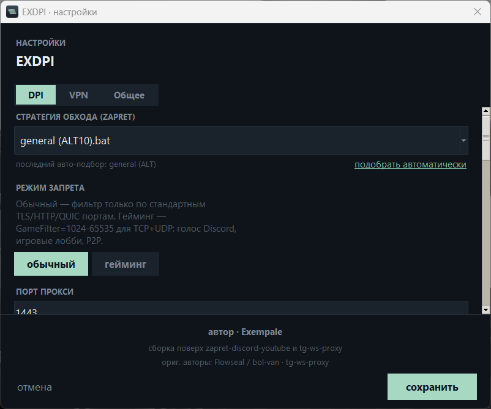</td>
    <td align="center"><b>Светлая</b><br>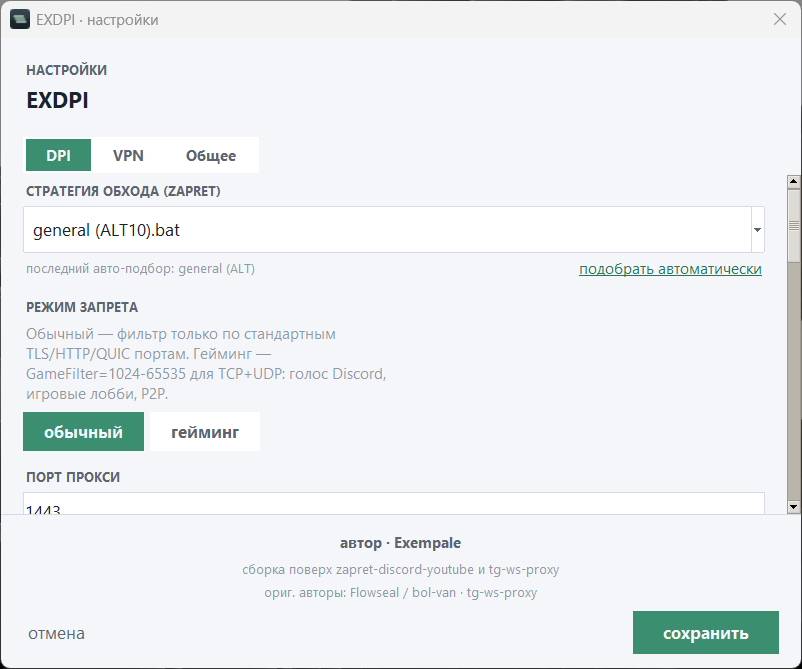</td>
  </tr>
</table>

Выбор стратегии zapret (`general*.bat`), авто-подбор стратегии, сегментный
переключатель «обычный / гейминг» (влияет на `GameFilter*` в `winws.exe`) и порт прокси.

### Вкладка VPN: параметры туннеля

<table>
  <tr>
    <td align="center"><b>Тёмная</b><br>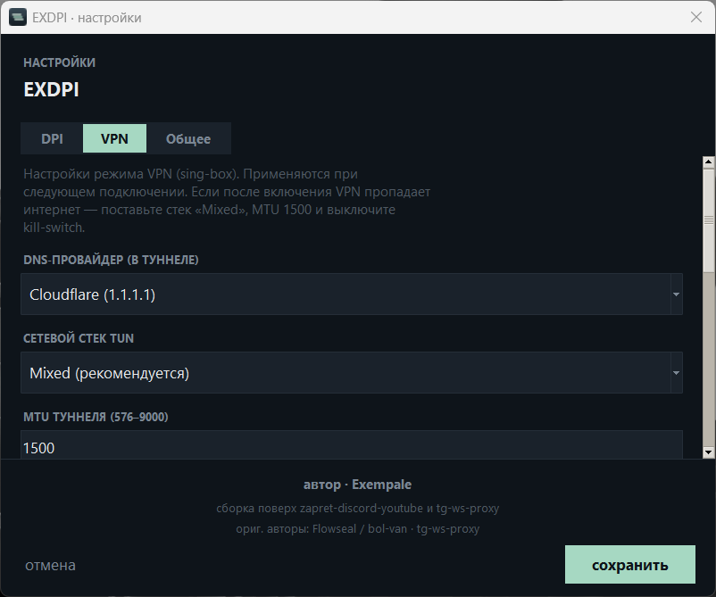</td>
    <td align="center"><b>Светлая</b><br>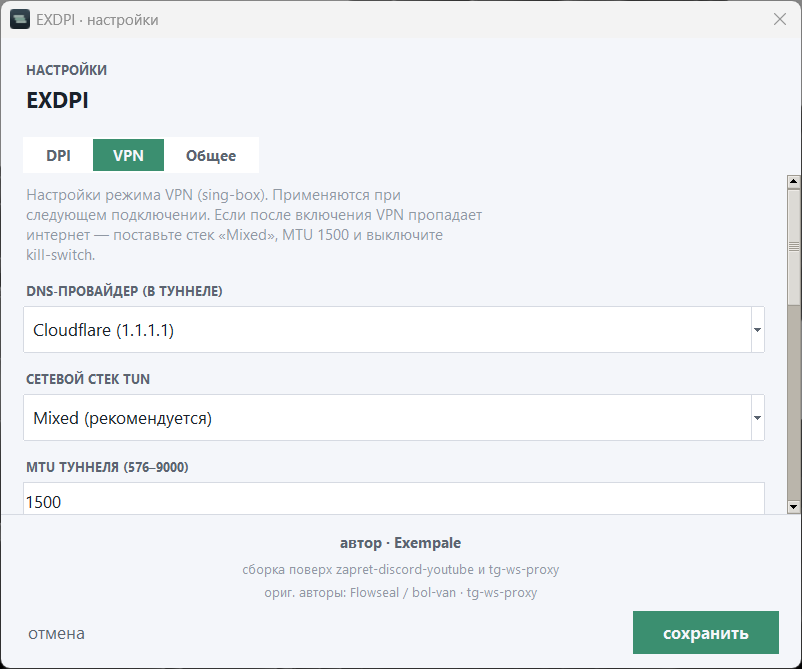</td>
  </tr>
</table>

DNS-провайдер в туннеле (DoH/DoT), сетевой стек TUN (Mixed рекомендуется) и MTU.

Если после включения VPN пропадает интернет, попробуйте стек Mixed, MTU 1500, kill-switch выключен.

### Вкладка Общее: система

<table>
  <tr>
    <td align="center"><b>Тёмная</b><br>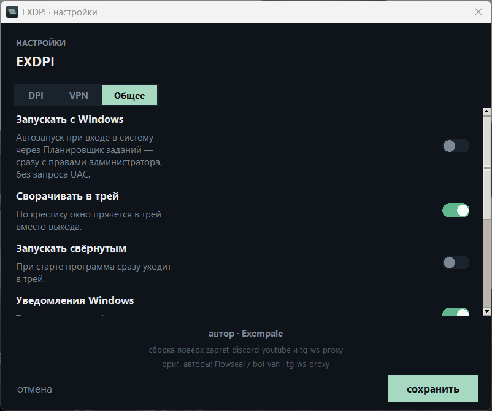</td>
    <td align="center"><b>Светлая</b><br>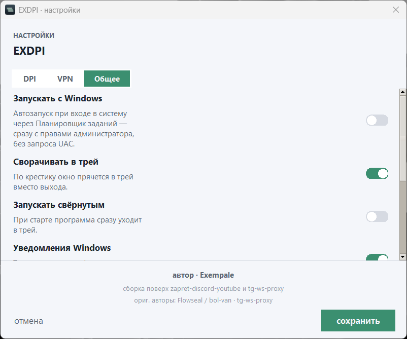</td>
  </tr>
</table>

Автозапуск с Windows (через Планировщик заданий, сразу с правами админа, без UAC),
сворачивание в трей по крестику, старт свёрнутым, уведомления Windows.

---

## Подключение Telegram к встроенному прокси (режим DPI, включая Voice Chats)

В режиме DPI EXDPI поднимает локальный MTProto-прокси на `127.0.0.1:1443`
(порт настраивается). Этот же прокси Telegram использует и для текста, и для
голосовых чатов (VC), отдельной настройки внутри VC делать не нужно.

### Telegram Desktop (Windows / macOS / Linux)

1. Запустите EXDPI в режиме DPI и включите большой переключатель ON.
2. В главном окне кликните по значку копирования рядом с `mtproto · 127.0.0.1:1443`, в буфер попадёт ссылка вида `tg://proxy?server=127.0.0.1&port=1443&secret=dd…`.
3. Откройте Telegram Desktop, зайдите в Настройки → Продвинутые настройки → Тип соединения.
4. Выберите «Использовать пользовательский прокси» → Добавить прокси → тип MTPROTO.
5. Либо вставьте параметры вручную: сервер `127.0.0.1`, порт `1443`, секрет (32-hex значение из настроек EXDPI). Либо просто вставьте `tg://proxy?…` ссылку, Telegram сам раскидает поля.
6. В правом верхнем углу Telegram появится зелёная иконка прокси: подключение установлено.

### Голосовые чаты (VC) и звонки

Telegram использует один и тот же прокси и для текста, и для голосовых чатов.
Если в VC вас не слышно или собеседник «прерывается», обычно проблема в
стратегии zapret, а не в прокси:

* Попробуйте другие стратегии: `general (ALT10).bat` (по умолчанию), затем `general (FAKE TLS AUTO).bat`, затем `general (SIMPLE FAKE).bat`.
* Включите гейминг-режим в настройках, он расширяет `GameFilter` до
  диапазона `1024-65535` для TCP+UDP, через который ходит голосовой трафик.

---

## Обычный vs гейминг режим (zapret)

Переключатель «режим запрета» в настройках реально меняет параметры запуска
`winws.exe`. Под капотом он подставляет порты в `%GameFilter*%` в `.bat`-стратегии:

| Режим | TCP-порты | UDP-порты | Когда выбирать |
|---|---|---|---|
| **Обычный** | стандартные TLS/HTTP (`80,443,…`) | `443,19294-19344,50000-50100` | Веб-сёрфинг, YouTube, обычный Telegram, экономия CPU. |
| **Гейминг** | `80,443,…` + `1024-65535` | `443,…` + `1024-65535` | Discord voice, Telegram VC, игровые лобби, P2P-трафик. |

Изменение применяется при следующем включении, либо сразу, если нажать «сохранить» при
включённом EXDPI (он автоматически перезапустит zapret).

---

## Готовые конфиг-листы (пресеты доменов)

В разделе «Готовые конфиг-листы» можно одним кликом загрузить набор доменов
вместо ручного ввода. Все файлы лежат в `blocklists/` и редактируемы:

| Пресет | Описание | Файл |
|---|---|---|
| Свой набор | Ваш собственный список, изначально пустой, сохраняется отдельно от пресетов. | — |
| ИИ-сервисы | ChatGPT, Claude, Devin, Gemini, Grok, Perplexity, HuggingFace. | `app/config.py: DEFAULT_CUSTOM_DOMAINS` |
| Игры и стриминг | Discord (текст+голос), Steam, Epic, Battle.net, Riot, Roblox, Twitch, OBS. | `blocklists/exdpi-games.txt` |
| Социальные сети | X/Twitter, Instagram, Facebook, Reddit, TikTok и др. | `blocklists/exdpi-social.txt` |
| Популярное в РФ | ИИ, видео, мессенджеры, новости, частые блокировки. | `blocklists/exdpi-popular-ru.txt` |

При сохранении настроек выбранные домены пишутся в
`resources/zapret/lists/list-general-user.txt`, который уже подхватывается
любой стратегией `general*.bat` через `--hostlist=...`.

---

## Темы оформления

Тёмная (по умолчанию) и светлая. Переключается иконкой «солнце/луна» в шапке
главного окна или в настройках. Применяется сразу, без перезапуска. Текущий выбор
сохраняется в `%APPDATA%\EXDPI\config.json`.

---

## Авто-обновления

EXDPI на старте проверяет GitHub Releases и предлагает скачать новую версию.
Логика отображения окна зависит от номера новой версии:

| Тип релиза | Пример | Поведение |
|---|---|---|
| **Обязательный** | `1.5.0`, `2.0.0` (третья цифра 0) | Окно нельзя закрыть. Любое закрытие или Esc завершает приложение, без обновления EXDPI не работает. |
| **Необязательный** | `1.5.1` … `1.5.9` (третья цифра не 0) | Можно «пропустить обновление», диалог уйдёт на 3 дня. |

В схеме `MAJOR.MINOR.PATCH` увеличение MINOR (и обнуление PATCH) означает критический релиз, апдейт обязателен. Увеличение PATCH, это мелкие правки, которые можно отложить.

---

## Структура

```
EXDPI/
├── main.py                 # Точка входа + UAC-эскалация
├── manifest.xml            # requireAdministrator
├── version_info.txt        # Метаданные exe
├── build.spec               # PyInstaller spec
├── app/
│   ├── theme.py            # Темы (dark/light) + apply_theme()
│   ├── presets.py          # Пресеты доменов (custom/ai/games/social/...)
│   ├── countries.py        # Флаги стран (рисованные) + детект по имени локации
│   ├── widgets.py          # AnimatedToggle, IconButton, StatusDot, ServerListBox
│   ├── ui_app.py           # Главное окно (переключатель режимов DPI/VPN)
│   ├── ui_settings.py      # Окно настроек (вкладки DPI / VPN / Общее)
│   ├── ui_wizard.py        # Мастер первого запуска
│   ├── ui_tg_guide.py      # Окно-инструкция по Telegram прокси
│   ├── ui_dpitest.py       # Окно «Проверить обход»
│   ├── ui_autostrategy.py  # Автоподбор стратегии zapret
│   ├── controller.py       # Стейт + объединение zapret / proxy / VPN
│   ├── zapret_runner.py    # Парсер .bat и запуск winws.exe
│   ├── proxy_runner.py     # Запуск tg-ws-proxy в фоновом потоке
│   ├── singbox_config.py   # Разбор ссылок/подписок → конфиг sing-box
│   ├── singbox_runner.py   # Запуск и управление ядром sing-box
│   ├── securedns.py        # DoH/DoT для режима VPN
│   ├── hwid.py             # Стабильный HWID устройства для подписок
│   ├── config.py           # JSON-конфиг в %APPDATA%\EXDPI
│   ├── updater.py          # Авто-проверка обновлений через GitHub Releases
│   ├── autostart.py        # Автозапуск Windows (Планировщик заданий)
│   ├── tray.py             # Системный трей (pystray)
│   ├── dpi_test.py         # TLS-handshake тестер
│   └── paths.py            # Резолв ресурсов (dev/PyInstaller onefile)
├── blocklists/             # Пресеты готовых доменов (.txt)
├── docs/screenshots/       # Скриншоты для README
├── proxy/                  # Исходники tg-ws-proxy (без изменений)
└── resources/
    ├── icon.ico
    ├── icon.png
    ├── singbox/            # sing-box.exe (ядро VPN)
    └── zapret/             # winws.exe + WinDivert + general*.bat + lists/ + bin/
```

Конфиг хранится в `%APPDATA%\EXDPI\config.json`. Удалите файл, параметры
сбросятся к дефолтам.

---

## Сборка из исходников

Понадобится Windows и Python 3.11+.

```bat
py -3.11 -m venv .venv
.venv\Scripts\activate

pip install -U pip
pip install -r requirements.txt

pyinstaller build.spec --clean --noconfirm
```

Результат: `dist\EXDPI.exe` (single-file). Флаг `--clean` важен, чтобы не
подтянулся старый кэш PyInstaller.

При желании добавьте `upx=True` в `build.spec` и UPX в `PATH`, чтобы ужать бинарник.

---

## Лицензии и происхождение

* Сборка / GUI: **Exempale** (`nevafav`).
* [zapret-discord-youtube]: Flowseal / bol-van (см. оригинальный репозиторий).
  Бинарь `winws.exe`, драйвер WinDivert и `general*.bat` стратегии взяты
  из оригинального релиза без изменений.
* [tg-ws-proxy]: оригинальный код в `proxy/`, не модифицирован.
* sing-box: ядро VPN (`resources/singbox/sing-box.exe`), проект SagerNet,
  используется без изменений.

Сам EXDPI распространяется под лицензией [GPL-3.0](LICENSE).

Это программное обеспечение является свободным: вы можете распространять его
и/или модифицировать в соответствии с условиями Стандартной общественной
лицензии GNU версии 3 (GNU General Public License v3.0). Текст лицензии
смотрите в файле [LICENSE](LICENSE).

---

<div align="center">

Если проект пригодился, звезда на репозитории или донат через кнопку ниже
помогут в дальнейшей разработке.

[](http://t.me/send?start=IV5iNcieHvH7)

</div>

[zapret-discord-youtube]: https://github.com/Flowseal/zapret-discord-youtube
[tg-ws-proxy]: https://github.com/Flowseal/tg-ws-proxy
